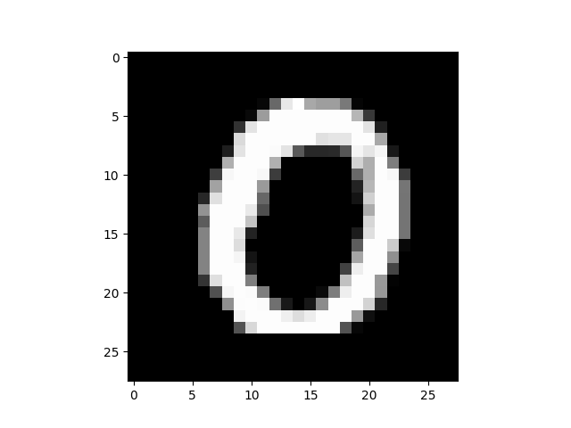
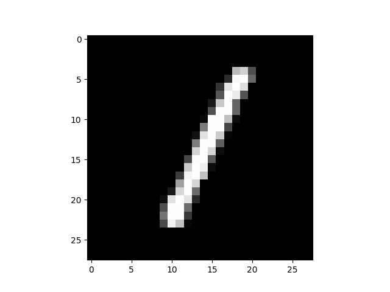
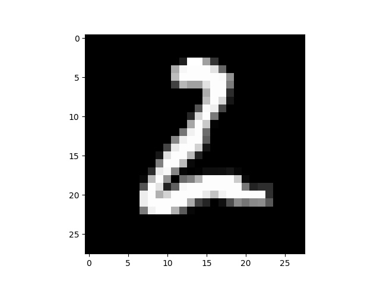
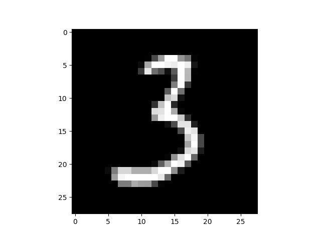
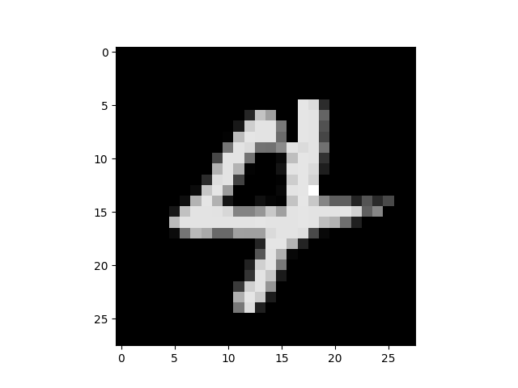
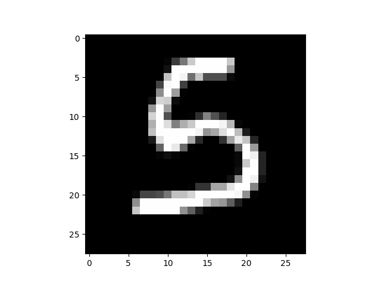
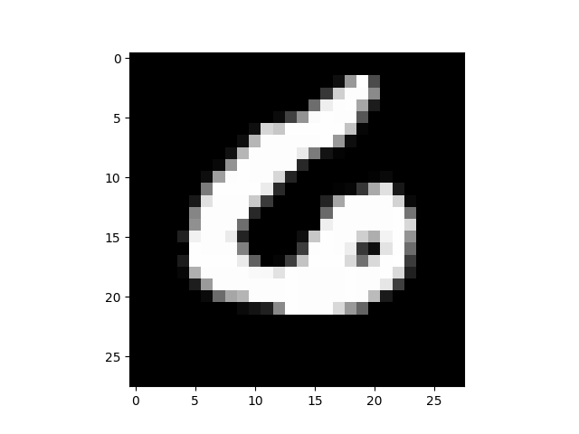
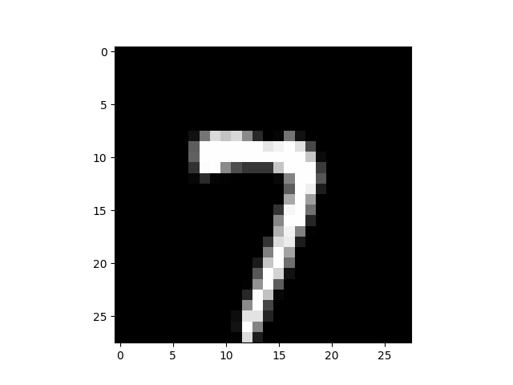
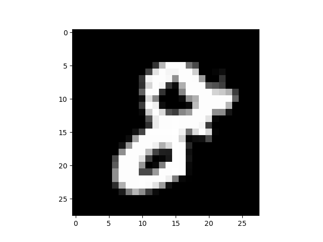
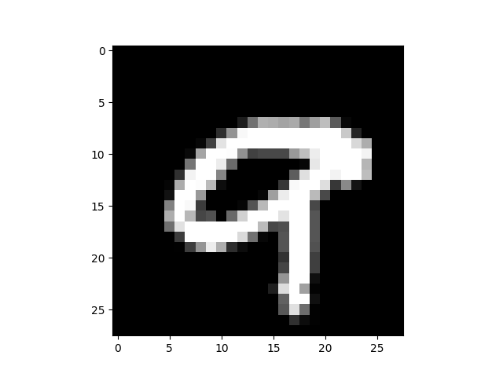

# MNIST-GPT

### Autocomplete for MNIST images

This repository demonstrates an autoregressive GPT model trained on the MNIST dataset to “autocomplete” pixel values in a 28×28 image. Instead of text, the model completes a sequence of 784 discrete pixel values (one token per pixel).

---

## GIF of a "4" Being Generated

Below is an example GIF illustrating how the digit “4” is generated pixel-by-pixel (with ungenerated pixels shown in light blue):


*(If the GIF doesn’t display, make sure the path is correct or open the file locally.)*

---

## Samples

Below are sample images generated by the model for digits 0–9:












And here are the corresponding GIFs of the same digits being generated (if you ran with the `--generate_gifs` flag):


*(If the images/GIFs are missing, make sure the paths align with your directory structure.)*

---

## Usage

You can generate images from the command line using the `run.py` script. For example:

```bash
python run.py \
    --targets "0,1,2" \
    --temperature 1.2 \
    --top_k 50 \
    --generate_gifs
```


## Command-line Arguments

You can generate images from the command line using the `run.py` script. For example:

```bash
python run.py \
    --targets "0,1,2" \
    --temperature 1.2 \
    --top_k 50 \
    --generate_gifs
```

### Available Arguments

- `--targets`: Comma-separated list of digits to generate (e.g. `"0,1,2"`). By default, it generates `[0..9]`.
- `--temperature`: Adjusts the randomness of sampling. Defaults to `1.0`.
- `--top_k`: Use top-k sampling. For example, `--top_k 50` keeps the top 50 tokens. Defaults to `None`.
- `--top_p`: Use nucleus (top-p) sampling. For example, `--top_p 0.9` keeps tokens whose cumulative probability ≤ 0.9. Defaults to `None`.
- `--generate_gifs`: If set, also generate pixel-by-pixel GIFs for each digit. Defaults to off.


## Descriptions of Files

- **`mnist_gpt.py`**  
  This file defines the `GPT` model architecture specialized for MNIST pixel (token) generation. It includes any relevant modules (transformer blocks, positional embeddings, etc.).

- **`mnist_gpt_train.ipynb`**  
  Jupyter notebook used to train the GPT model on MNIST data. It likely includes data preprocessing, model initialization, training loops, etc.

- **`run.py`**  
  Command-line script that loads the trained GPT model (`trained_model_state_dict.pt`), accepts command-line arguments, generates digits, and saves outputs (PNGs and optionally GIFs).

- **`trained_model_state_dict.pt`**  
  The PyTorch state dictionary for the pre-trained GPT. This file contains all the learned weights.